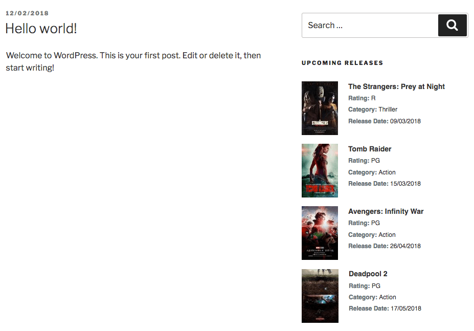
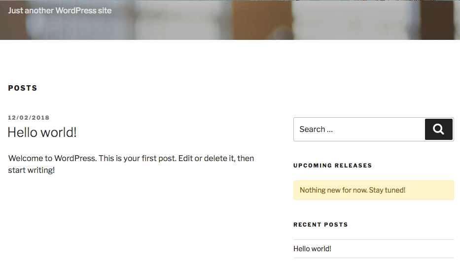
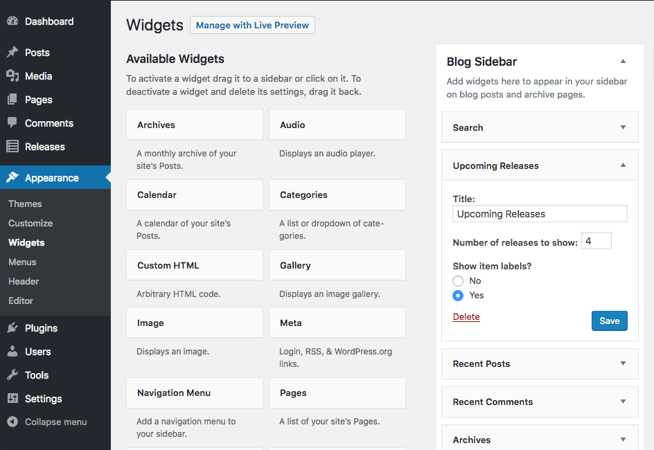
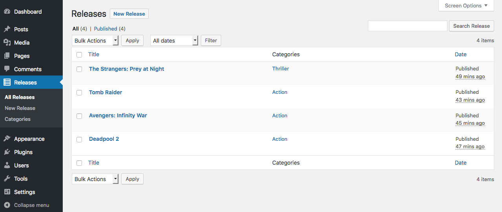
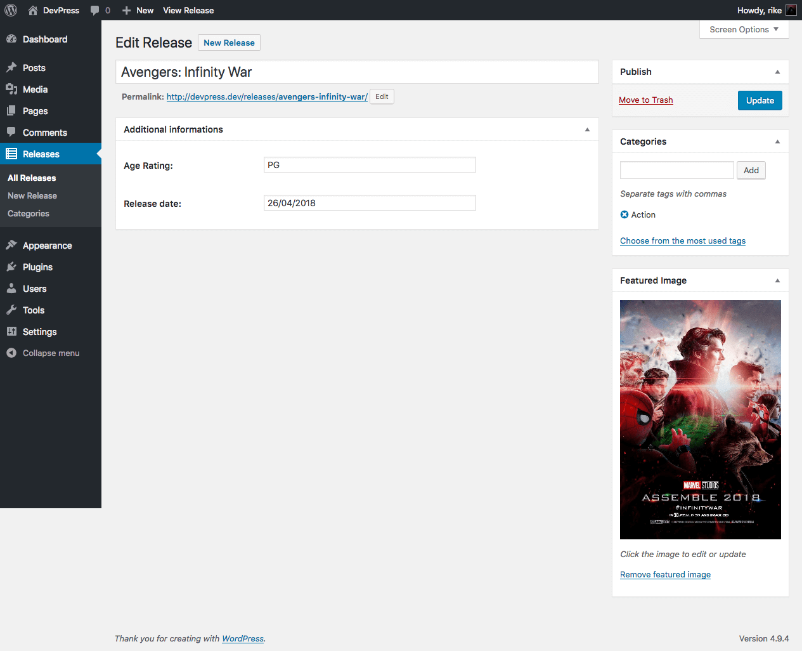

# WP Upcoming Releases

Widget to show a list of upcoming releases: movies, games, musics, or any other thing your creative ideas needs. Easy management with custom post types and categories.

## Contributing

You can contribute with this plugin development by:

- Reporting issues.
- Solving bugs, with pull requests.
- [Donating](https://pag.ae/bhdkncn) **any amount** to help me drink a coffee.

## Support

Have any questions about using the plugin? You're welcome.

Just follow these simple steps:

- Carefully read all the documentation.
- Search topics on our [support forum](https://wordpress.org/support/plugin/wp-upcoming-releases), maybe someone else already have answered your questions.

If after carefully following the steps above, your questions/problems are not solved, then you should **open a new topic** on our [support forum](https://wordpress.org/support/plugin/wp-upcoming-releases).

All support requests out of the forum, will be **not answered**.

## Installation

This section describes how to install the plugin and get it working.

**Note:** Your theme will need a [dynamic sidebar](https://codex.wordpress.org/Function_Reference/dynamic_sidebar) to display recorded items.

### Install searching in the WordPress dashboard

1. Navigate to the 'Add New' in the Plugins menu
2. Search for 'wp upcoming releases'
3. Click 'Install Now'
4. When download finishes, click 'Activate'

### Install uploading plugin files in WordPress dashboard

1. Navigate to the 'Add New' in the Plugins menu
2. Click 'Upload Plugin' button
3. Select `wp-upcoming-releases.zip` from your computer
4. Click 'Install Now'
5. Activate the plugin in the 'Installed Plugins' page

### Install using FTP

1. Download `wp-upcoming-releases.zip`
2. Extract the `wp-upcoming-releases` directory to your computer
3. Upload the `wp-upcoming-releases` directory to the your server `/wp-content/plugins/`
4. Activate the plugin in the 'Installed Plugins' page

### Add the widget into your dynamic sidebar

1. Go to 'Appearance' -> 'Widgets'
2. Add the 'Upcoming Releases' widget on any available area of your theme.

## Frequently Asked Questions

### What is the plugin license?

This plugin is released under GPLv3 (or later) license.

## Screenshots

### 1. Front-End display of Upcoming Releases

### 2. Front-End display "not found" message

### 3. Back-End widget configurations

### 4. Back-End listing recorded items

### 5. Back-End editing a item

